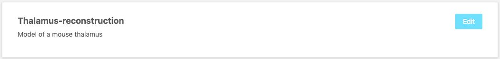

# Creating an Organization

Click on the "Create organization" icon next to the title of the homepage to create a new organization.

#### Editing or deprecating an Organization

On the list of organizations, click on the "edit" button that appear when hovering on an organization. You'll be able to edit the description of the organization and hit "Save" to modify it. To deprecate the organization, hit the "Deprecate" button.

#### Creating a Project

Navigate to the organization where you want to create your project. Click on the "Create Project" icon next to the title of the page.

#### Editing or deprecating a Project

Navigate to the organization where your project is. Click on the "Edit" button that appear when you hover a project in the list. You'll be able to edit its description and hit save to modify it. Hit "Deprecate" to deprecate the project.

