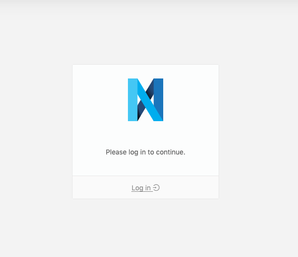

@@@ index

- [Studio](./studio/index.md)

@@@

# Nexus Web

Nexus Web is the web interface for Blue Brain Nexus, allowing users to interact with data and perform administration tasks. It is being actively developed and new features are regularly added.

Follow development at the [Blue Brain Nexus Web Github repo](https://github.com/BlueBrain/nexus-web).

## Browse Resources

Search and filter data within a project.

@ref:[Browsing Resources](browse/index.md)

## Administration

Set up organizations and projects.

@ref:[Administrate your instance](admin/index.md)

## Studio

Configure customizable persistent queries with customizable visualizers to curate your data.

@ref:[Configure a studio to visualize your data](studio/index.md)

## Resource View

View resource data, and visualize relationships between resource instances

@ref:[View a Resource](resource-view/index.md)

## Login

You can login with your user to access non-public resources (depending on your permissions).

#### Copy Auth Token for reuse with other Nexus-related tools

Once logged-in, you can copy your authentication token, in order to easily reuse it in, for example, an IPython Notebook or the Nexus CLI client.

