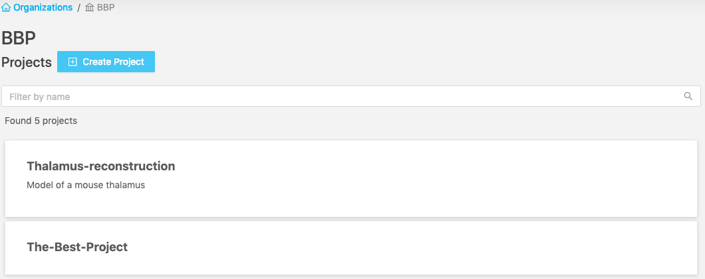
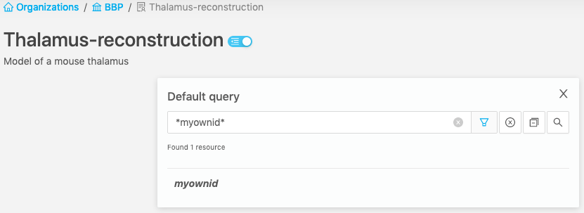
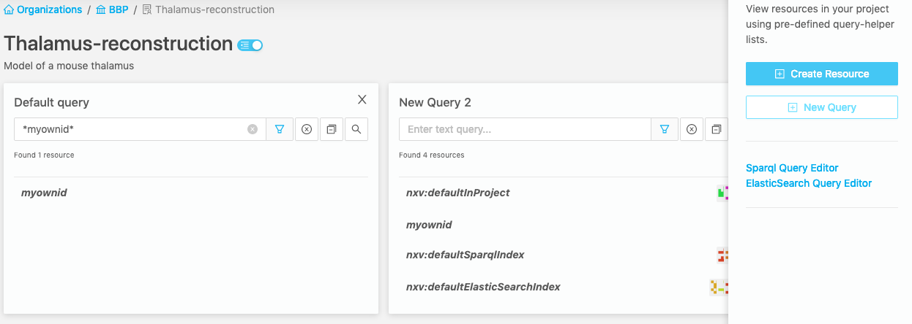
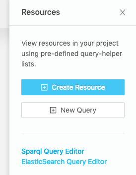
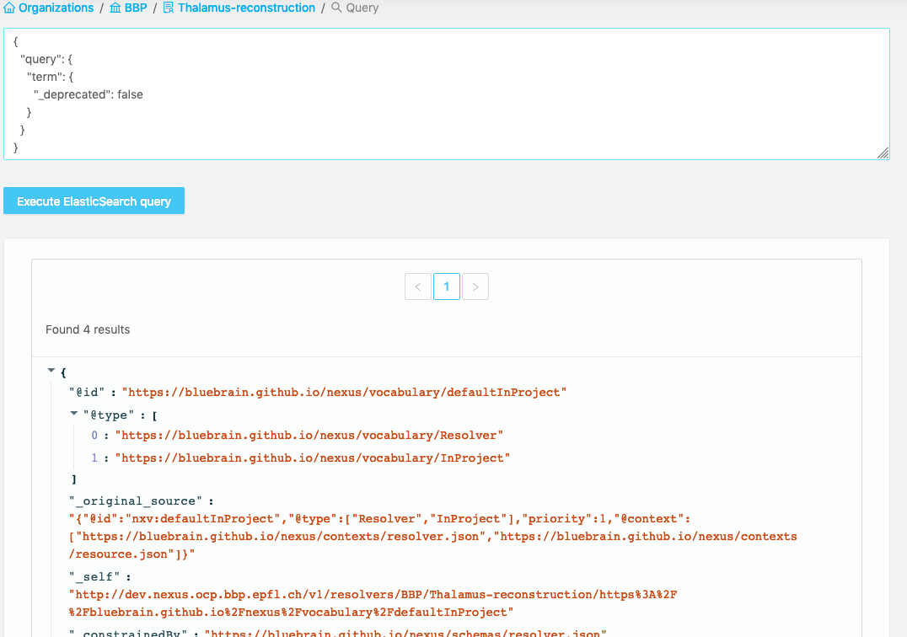
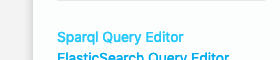
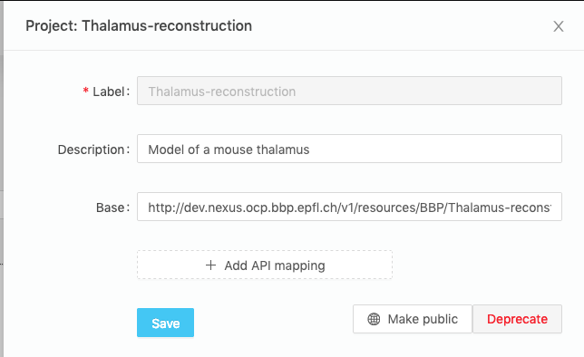
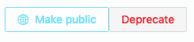
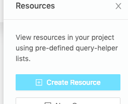

@@@ index

- [Studio](./studio/index.md)

@@@

# Nexus Web

Nexus Web is the web interface for Blue Brain Nexus, allowing users to interact with data and perform administration tasks. It is being actively developed and new features are regularly added.

It currently contains the following features:

### Login

You can login with your user to access non-public resources (depending on your permissions).

#### Copy Auth Token for reuse with other Nexus-related tools

Once logged-in, you can copy your authentication token, in order to easily reuse it in, for example, an IPython Notebook or the Nexus CLI client.

### Browsing data

To group and control access to your data, Nexus provides you Organizations and Projects. Much like in Github (if you're familiar with it), there are Organizations which contain Projects (Repositories in Github), which in turn contain your data (files in GitHub, Resources in Nexus).

In Nexus Web, the landing page will show you the list of Organizations you have access to.

After selecting an organization, you will see the list of Projects you have access to inside this organization.

Select a Project, you'll get to the list of its Resources.

You can search resources using the ElasticSearch query syntax.

###### Details View

Click on a resource and you'll see a more detailed view with important metadata displayed on a card on the top, as well as a JSON-lD form that may or not be editable, depending on the selected resource's schema (uploaded files cannot be edited, for example.)

###### Links View

Inside the Details View you'll find a tab called Links. Here you can find two lists,
one for Incoming Links and one for Outgoing Links. Incoming Links are other datasets that reference this dataset. Outgoing links are other datasets that are referenced inside this one. This is very helpful to navigate down the chains of references you have, by clicking on a link you'll be taken to that resource's details page, or brought to the web url if it's an external resource (a referenced URI, but not a resource integrated into the platform)

###### Graph View

Inside the Details View you'll also find a tab that contains a WIP graph visualizer.
This will be more useful as navigation functionalities are implemented, but for now
it's helpful to visualize how the dataset is a collection of nodes (subjects) linking predicates (the yellow lines) to objects (other nodes).

##### Advanced use-cases

If you want to have several filtered lists of resources side by side, you can create additional filterable lists by using the "New Query" button in the side panel. It can be handy to make comparisons, or to build a set of ElasticSearch queries we want to reuse in an IPython Notebook or in a script.

You can also clone one of the active Queries to use it as a starting point.

If you need to make complex ElasticSearch queries or if you want to see the raw payload returned by ElasticSearch, you can click on "ElasticSearch query editor". Results will be displayed in JSON-LD format.

For graph and RDF-related queries, we also offer a SPARQL query editor that runs against our triple-store. Results are displayed in a table.

### Managing your Nexus instance

#### Creating an Organization

Click on the "Create organization" icon next to the title of the homepage to create a new organization.

#### Editing or deprecating an Organization

On the list of organizations, click on the "edit" button that appear when hovering on an organization. You'll be able to edit the description of the organization and hit "Save" to modify it. To deprecate the organization, hit the "Deprecate" button.

#### Creating a Project

Navigate to the organization where you want to create your project. Click on the "Create Project" icon next to the title of the page.

#### Editing or deprecating a Project

Navigate to the organization where your project is. Click on the "Edit" button that appear when you hover a project in the list. You'll be able to edit its description and hit save to modify it. Hit "Deprecate" to deprecate the project.

#### Making a project publicly accessible

Navigate to the edition page for the project. Hit the "Make project public" to make the project and all the data it contains publicly accessible.

#### Creating Resources

Navigate to the project where you want to create a resource. Click on the "Create Resource" button in the right sidebar. Build the JSON payload with the help of the interactive editor, then hit "Save".

