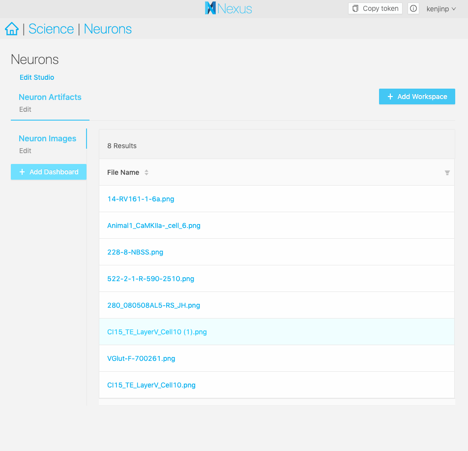

# Creating a Studio Step by Step

A studio is a place where you can organize your data and configure custom plugins to visualize them.

In this example, we'll make one that simply displays images from files.

## Set up your project

We've uploaded some nice neuron morphology images from [Neuromorpho.org](neuromorpho.org), which are showing up in our project.

Now, nexus-web has out-of-the-box image preview support for images less than 3MB inside the normal project view, but in this example we have customers who want to view the data as organized inside tables.

;

## Setting up your studio

You can create a studio from within a project by clicking on the Project Action Menu on the right hand side, under the Studios tab.

;

It will prompt you to come up with a label for your project. Here we called it Neuron Studio. Think of a Studio as a landing page for all your data to be organized. In most cases you'll only need one Studio.

;

Next, create a workspace. A workspace allows you to group your queries and visualizations together, you can have one or more of such groups.

We'll create a workspace to put all our artifacts, that is files as opposed to json-ld datasets. In this case, our neuron images.

;

## Creating a Dashboard

Next, we'll create a Dashboard. The Dashboard is where our data will be rendered and visible for us to explore, rendered for now as a table, with more options to come in future versions. Every Dashboard is essentially a saved SPARQL query, paired with a plugin to visualize each row in the table.

We'll click on the big blue Create a Dashboard button and label it Neuron Images. Now we'll need to write a sparql statement to extract every file that's an image from the knowledge graph. Here's an example that will grab us that information:

```sparql
# This is a simple example query
# You can directly edit this
prefix nxv: <https://bluebrain.github.io/nexus/vocabulary/>
prefix rdf: <http://www.w3.org/1999/02/22-rdf-syntax-ns#>
SELECT DISTINCT ?self ?fileName
WHERE {
?s nxv:self ?self;
   rdf:type nxv:File;
   nxv:mediaType "image/png";
   nxv:filename ?fileName
}
LIMIT 20
```

;

And now here's our dashboard. Now we can share this URL with other people and they'll be able to see the results of our query as well.

;

## Adding a plugin

But there's one problem, clicking on one of the file names will show us an error `No Plugins Configured`.

Let's develop a small plugin the displays the image with a title. Here's an implementation in Typescript:

```typescript
import { Resource, NexusClient, NexusFile } from "@bbp/nexus-sdk";

import "./style.less";

export const ImagePlugin = ({
  ref,
  resource,
  nexusClient
}: {
  ref: HTMLElement;
  resource: Resource;
  nexusClient: NexusClient;
}) => {
  nexusClient
    .httpGet({
      path: resource._self,
      context: {
        parseAs: "blob"
      }
    })
    .then(file => {
      const blob = new Blob([file as string], {
        type: (resource as NexusFile)._mediaType
      });
      const src = URL.createObjectURL(blob);
      const img = document.createElement("img");
      img.src = src;
      img.alt = resource._filename;
      img.title = resource._filename;

      const title = document.createElement("h1");
      title.textContent = resource._filename;
      ref.appendChild(title);
      ref.appendChild(img);
    })
    .catch(console.error);
};

export default ImagePlugin;
```

> A simple plugin that fetches a file from the resource metadata and appends it as an image on the document

## Uploading a plugin

Adding this the bundled Javascript in the `/plugins` folder of the root of your nexas web instance, such as `/plugins/nexus-image-plugin/index.js`, will allow Nexus Web to find the file and display it. Be sure to restart your nexus-web instance.

## Configure your dashboard to use a plugin

Now you can navigate to your studio dashboard and click on the `edit` button next to your dashboard name. You'll find your plugin available in the autocomplete field under plugins. Select your plugin, and hit save.

;

Now when you click on a row of your table, you should see your plugin displaying your data in its full glory.

;
