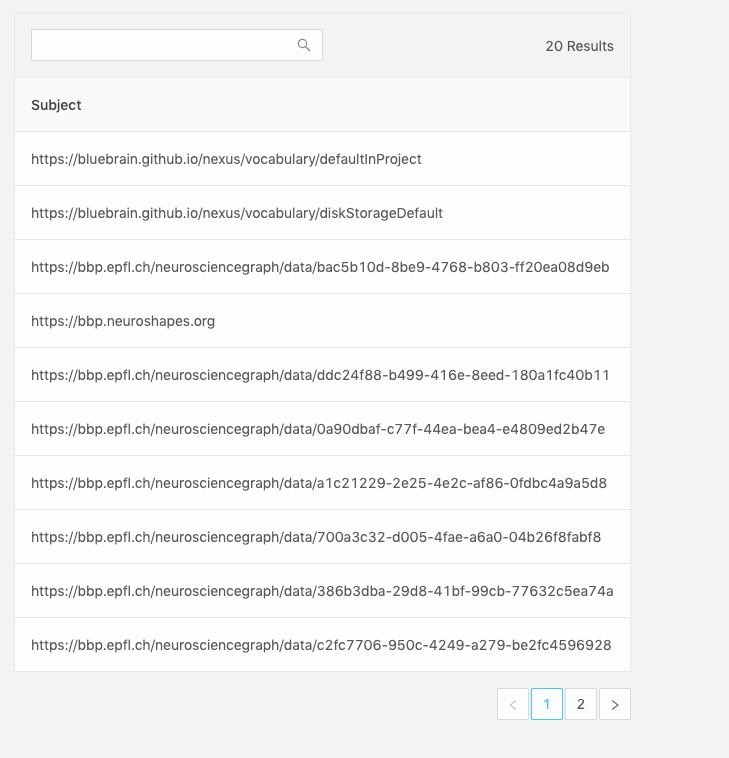

# Dashboards

## What is a dashboard?

A `Dashboard` is simply a query with a description and label. This will be used by the `Workspace` to query against the view paired with it inside the `Workspace` configuration. This way, you can write one query, and re-use it against multiple potential views.

An example `Dashbaord` resource looks like this:

```json
{
  "@context": "https://bluebrainnexus.io/studio/context",
  "@type": "StudioDashboard",
  "dataQuery": "prefix nxv: <https://bluebrain.github.io/nexus/vocabulary/>\nprefix s: <http://schema.org/>\nSELECT DISTINCT ?self ?familyName ?givenName\nWHERE {\n?s nxv:constrainedBy <https://neuroshapes.org/dash/person> ;\n  nxv:self ?self ;\n  s:familyName ?familyName ; \n  s:givenName ?givenName\n}\nLIMIT 20",
  "description": "A list of every scientist",
  "label": "Scientists",
  "plugins": ["nexus-plugin-example"]
}
```

The `Dashboard`, once configured, will present the results of your sparql query in a table. Each item in the row will be clickable and lead to a details page showing the `Resource`, in this case, a list of scientists that have contributed data to the project.


## Plugins (Experimental!)

There's also an experimantal `plugin` key in the configuration that can be used to load experimental nexus plugins. These plugins will be loaded into the `Details` page of a resource.

> [plugin development documentation](./docs/pluginDevelopment.md).

## Creating a dashboard?

Inside any `Studio View`, under a selected `Workspace`, click the `Add Dashboard` button.


..and fill in a form providing the following:

- `Label`: the name of your new `Dashboard` (required field)
- `Description`: an optional description for your `Dashboard`
- `Plugins`: an optional list of plugins to add to the details page of a query result
- `Sparql Query`: a valid [SPARQL](https://www.w3.org/TR/rdf-sparql-query/)query that conforms to the `dataQuery` field in the configuration.


> You can click on the "view query in Sparql Editor" to open the `Sparql Editor` in a new tab to work on your query while querying it against a `Sparql View` in your project, so you can make sure it works and provides the fields you want. Then, you can copy and past that back in the form.

- Click `Save` and the `Dashboard` and its query results should show up!

You can now also add this `Dashboard` to other `Workspaces` across the project.

### Sparql Query Requirements

#### The `?self` variable

In order for the UI to function as intended, you must provide a unique ID variable inside your Sparql statement, labeled as `?self`. This will be used to generate the table and fetch resources when navigating to the details page of a row item. Ideally, this `?self` variable should correspond with the `_self` of a target `Resource` of which to center your query against as a subject. The `?self` variable will never be shown in the table, so you need some other variable in addition to view the results properly, or you'll end up with a table without any rows.

#### Making queries visible

In addition to the `?self` variable, you need to have at minimum one other one defined, which will be displayed on each row. The variable name will label the header of the table column, capitalized.

#### The minimum functioning query with the `?self` variable defined:



```sparql
# This is the minimum functioning query for Studio
prefix nxv: <https://bluebrain.github.io/nexus/vocabulary/>
SELECT DISTINCT ?subject ?self
WHERE {
?subject nxv:self ?self ;
}
LIMIT 20
```

### Example Sparql Queries

Here's an example of fetching unique Persons using `https://schema.org` properties.

```sparql
prefix nxv: <https://bluebrain.github.io/nexus/vocabulary/>
prefix s: <http://schema.org/>
SELECT DISTINCT ?self ?familyName ?givenName
WHERE {
?s nxv:constrainedBy <https://neuroshapes.org/dash/person> ;
  nxv:self ?self ;
  s:familyName ?familyName ;
  s:givenName ?givenName
}
LIMIT 20
```

## Updating a dashboard?

You'll find the edit `Dashboard` button by hovering over the label of a dashboard


Clicking that will lead you to a similar form as in the "Creating a dashboard?" section.

After your forms have been edited, simple click `Save` to update the changes.

## Removing a dashboard?

You can remove a workspace by deprecating it from the `Resource View`
