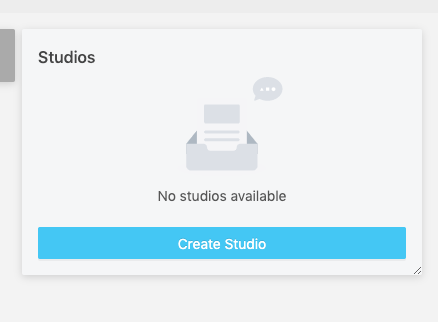
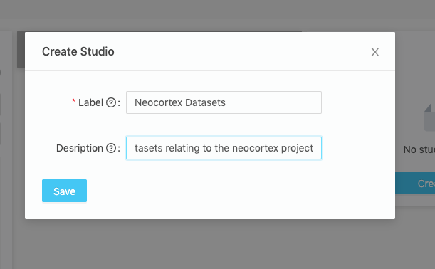
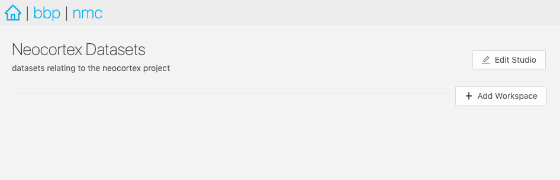

@@@ index

- [Workspaces](./workspaces.md)
- [Dashboards](./dashboards.md)
- [Plugin Development](./plugin-development.md)

@@@

# Studio _βeta_

> Note: This feature is under heavy development and should be considered in Beta

This feature allows data curators to display their data using customisable, persistent queries. Using custom plugins developed with javascript, data curators can format the presentation of the query results any way they like.

## Plugins

A core component of Studio is the ability for data curators to develop a domain-specific presentation layer for their resources in Nexus Web. This allows data consumers to visualize their datasets using graphs, charts, or 3D visualizations, and to present the relevant metadata to the user.

Plugins are developed using javascript and are loaded into the Nexus Web instance from in the `/plugins` folder.

@ref:[Learn about Plugin Development](./plugin-development.md)

## What is a Studio?

A studio is a collection of persistant queries organized in a table layout for users to quickly access relevant data in a customizable way. Studio authors can create a studio to match a specific topic, and create organization schemes called workspaces and dashboards to access various aspects of that data.

For example, a studio might cover all datasets from the `Neocortex`, with a workspace called `Physiology` and a dashboard called `Morphology Pipeline`.

In essence, a studio is a UI layer that performs queries according to a configuration that lives in a Nexus instance as a Resource. It has a `label` for a meaningful title and a `description` field to convey to the users what sort of data they can expect to find there. Most importantly, a studio configuration has a `Workspace` collection.

@ref:[Workspace documentation](./workspaces.md)

```json
{
  "@context": "https://bluebrainnexus.io/studio/context",
  "@type": "https://bluebrainnexus.io/studio/vocabulary/Studio",
  "description": "",
  "label": "test",
  "workspaces": [
    "https://nexussandbox.io/org/project/3bdf8b08-7b9a-443b-b04d-be2a048893ba"
  ]
}
```

> Note: A studio will be given a URI for navigation or sharing.

### About the Studio Context

In order for the studio to work as intended with the UI, a context must be in the project. It's purpose is to direct the knowledge graph to understand how studio-specific properties behave, such as that `workspaces` should be set (an unordered collection without duplicates).

If you create a studio using the UI in Nexus web, this resource will be created for you, if it doesn't exist already. If you plan on bootstrapping your own projects programmatically, such as through the API, then you might need to take care to include it.

Every `Studio` resource that is created should reference this context resource as the `@context` property. For an example, see the `Studio` resource mentioned above. The default studio context `@id` for all our examples will be `https://bluebrainnexus.io/studio/context`, and it's what Nexus-Web will use.

Here's what the context should look like:

```json
"{
  "@context": [
    {
      "@base": "https://bluebrainnexus.io/studio/",
      "@vocab": "https://bluebrainnexus.io/studio/vocabulary/",
      "label": {
        "@id": "http://www.w3.org/2000/01/rdf-schema#label"
      },
      "name": {
        "@id": "http://schema.org/name"
      },
      "description": {
        "@id": "http://schema.org/description"
      },
      "workspaces": {
        "@id": "https://bluebrainnexus.io/studio/vocabulary/workspaces",
        "@container": "@set",
        "@type": "@id"
      },
      "plugins": {
        "@id": "https://bluebrainnexus.io/studio/vocabulary/plugins",
        "@container": "@set"
      },
      "dashboards": {
        "@container": "@set"
      },
      "dashboard": {
        "@id": "https://bluebrainnexus.io/studio/vocabulary/dashboard",
        "@type": "@id"
      },
      "view": {
        "@id": "https://bluebrainnexus.io/studio/vocabulary/view",
        "@type": "@id"
      }
    }
  ],
  "@id": "https://bluebrainnexus.io/studio/context"
}"
```

## Creating a studio

To create a new studio, select a project.
In the Project View, you will see a list of Studios with the `Create Studio` button.

Click the `Create Studio` button.



..and fill in a form providing the following:

- `Label`: the name of your new Studio (required field)
- `Description` for your Studio



- Click `Save` and you will be navigated to the Studio View.



That's it! Your new Studio is empty for now, but don't worry!
We will add Workspaces and Dashboards later.

You can also find your Studios in the Resource List (for example, filter by type `Studio`, or Search by id) and view it in the Resource View.

## Updating a studio

Once created, a label and a description of a Studio can be changed.
Just click `Edit Studio` button and update `Label` and `Description` fields.

## Removing a studio

To remove an unwanted Studio, deprecate it in the Resource View.
