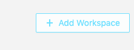
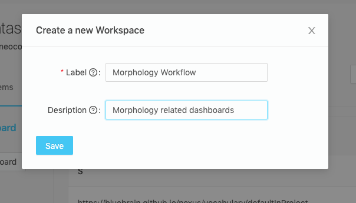
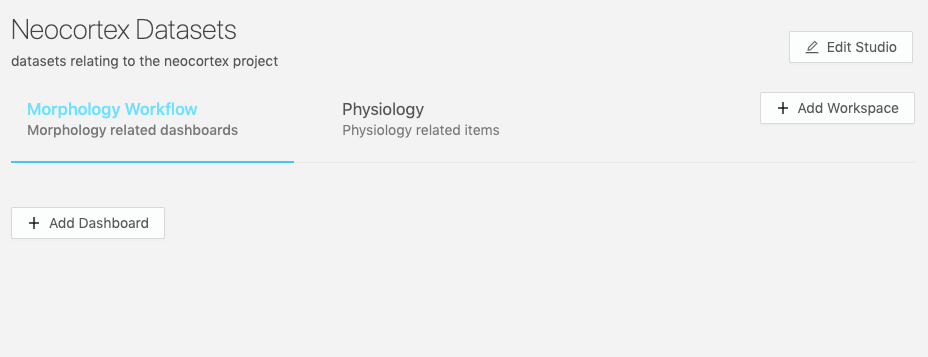
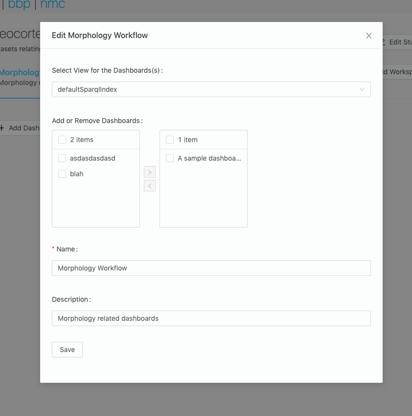

# Workspaces

## What is a workspace?

A workspace is a collection of `Dashboards` paired with a `View`. You can have any number of `Dashboard`-`View` pairings organized into a `Workspace`.
You can label a `Workspace` and add a description to help users understand what kind of content they can expect to find there.

> @ref:[Dashboard documentation](./dashboards.md)

```json
{
  "@context": "https://bluebrainnexus.io/studio/context",
  "@type": "StudioWorkspace",
  "dashboards": [
    {
      "dashboard": "https://bbp.epfl.ch/neurosciencegraph/data/8751df37-a75f-4858-b174-742264deb4e9",
      "view": "nxv:defaultSparqlIndex"
    },
    {
      "dashboard": "https://bbp.epfl.ch/neurosciencegraph/data/99982da8-ec3a-4f18-9388-a0cc81bfff0c",
      "view": "nxv:defaultSparqlIndex"
    }
  ],
  "description": "",
  "label": "MorphoTester"
}
```

## Creating a workspace?

Inside any `Studio View`, click the `Add Workspace` button.



..and fill in a form providing the following:

- `Label`: the name of your new `Workspace` (required field)
- `Description` for your `Workspace`



- Click `Save` and you will be navigated to the new workspace section of your `Studio View`, which is given a navigable URI.



Your `Workspace` is created, but it will need to have at least one `Dashboard`/`View` association for anything to show there.

You can also find your `Workspaces` as raw `JSON` configurations in the `Resource` list (for example, filter by type `StudioWorkspace`, or search by id) and view it in the `Resource View`.

## Updating a workspace?

Inside any `Studio View`, hover over a `Workspace` tab label and click on the hovering edit icon


Then you'll be provided with a dialogue where you can review and edit the `Workspace` configuration.

- `Select View`: The view of which to pair with _each `Dashboard` inside the follow transfer list_. The `Dashboard` queries will be ran against the `View` listed inside this box. For now, using this edit form, you can only pair one `View` for all `Dashboards`. If you were to create the configurations manually, you can pair each `Dashboard` with a different `View`.
- `Add or Remove Dashboards`: Add or remove a `Dashboard` to the collection in your workspace configuration. The `Dashboards` listed are all the available non-deprecated ones in the project.
- `Name`: the name of your new `Workspace` (required field).
- `Description` for your `Workspace`.



After your forms have been edited, simple click save to update the changes.

## Removing a workspace?

You can remove a workspace by deprecating it from the `Resource View`
