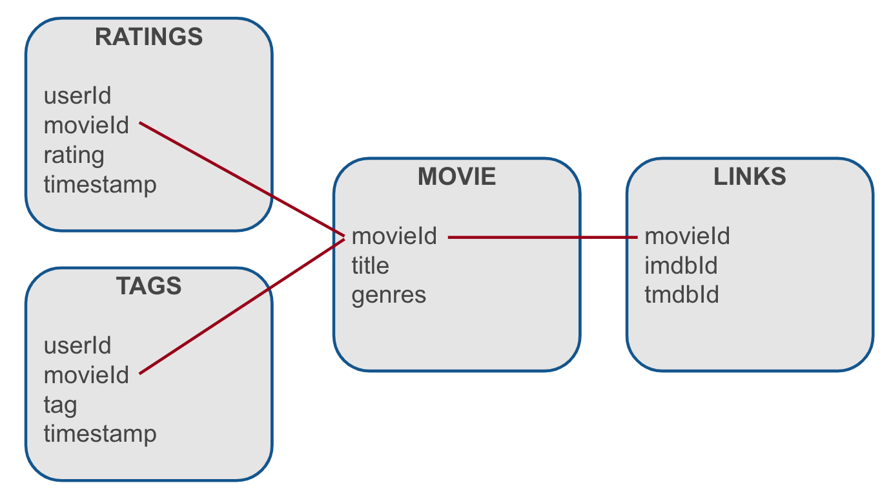

# The MovieLens Dataset


## Overview

The picture below describes the structure of the 4 files contained in the MovieLens dataset:


 
Once you have downloaded and unpacked the archive, you will find 4 CSV files, below is the top 10 lines of each to give 
you a feel for the data it contains. As you can see the movieId column of each of these files will be instrumental to 
linking the data together.

```shell

$ head *.csv

==> links.csv <==
movieId,imdbId,tmdbId
1,0114709,862
2,0113497,8844
3,0113228,15602
4,0114885,31357
5,0113041,11862
6,0113277,949
7,0114319,11860
8,0112302,45325
9,0114576,9091

==> movies.csv <==
movieId,title,genres
1,Toy Story (1995),Adventure|Animation|Children|Comedy|Fantasy
2,Jumanji (1995),Adventure|Children|Fantasy
3,Grumpier Old Men (1995),Comedy|Romance
4,Waiting to Exhale (1995),Comedy|Drama|Romance
5,Father of the Bride Part II (1995),Comedy
6,Heat (1995),Action|Crime|Thriller
7,Sabrina (1995),Comedy|Romance
8,Tom and Huck (1995),Adventure|Children
9,Sudden Death (1995),Action

==> ratings.csv <==
userId,movieId,rating,timestamp
1,1,4.0,964982703
1,3,4.0,964981247
1,6,4.0,964982224
1,47,5.0,964983815
1,50,5.0,964982931
1,70,3.0,964982400
1,101,5.0,964980868
1,110,4.0,964982176
1,151,5.0,964984041

==> tags.csv <==
userId,movieId,tag,timestamp
2,60756,funny,1445714994
2,60756,Highly quotable,1445714996
2,60756,will ferrell,1445714992
2,89774,Boxing story,1445715207
2,89774,MMA,1445715200
2,89774,Tom Hardy,1445715205
2,106782,drugs,1445715054
2,106782,Leonardo DiCaprio,1445715051
2,106782,Martin Scorsese,1445715056
```