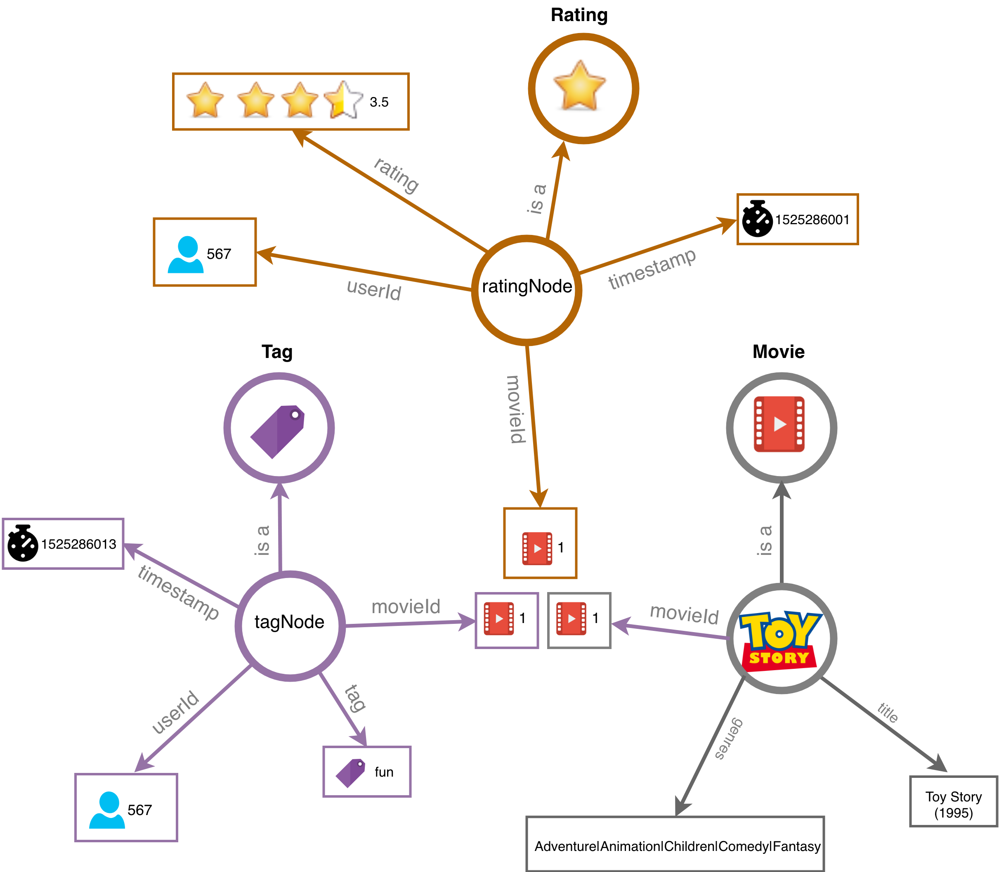

# Quick Start


## Overview

This example-driven tutorial presents 5 steps to get started with Blue Brain Nexus to build and query a simple [knowledge graph](../../knowledge-graph/thinking-in-graph.html).
The goal is to go over some capabilities of Blue Brain Nexus enabling:

* The creation of a project as a protected data space to work with
* An easy ingestion of dataset and management of it's lifecycle
* Querying a dataset to retrieve various information
* Sharing a dataset by making it public

For that we will work with the small version of the [MovieLens dataset](http://files.grouplens.org/datasets/movielens/ml-latest-small.zip) containing a set of movies (movies.csv) along with their ratings (ratings.csv) and tags (tags.csv) made by users.
An overview of this dataset can be found [here](../dataset/index.html).

@@@ note
* This tutorial makes use of an AWS deployment of Blue Brain Nexus available at https://sandbox.bluebrainnexus.io/v1.
* We will be using [Nexus CLI](https://github.com/BlueBrain/nexus-cli), a python client,  to interact with the deployment.
@@@

Let's get started.

## Set up


### Install and setup the Nexus CLI

Since the CLI is written in python, you may want to create a virtual environment for a clean set up. To do so, Conda can be used. If you don't have it installed follow the instructions [here](https://conda.io/projects/conda/en/latest/user-guide/install/index.html).

```shell
conda create -n nexus-cli python=3.5
conda activate nexus-cli
pip install git+https://github.com/BlueBrain/nexus-cli
```


### Create and select a 'tutorial' profile

To ease the usage of the CLI, we will create a profile named 'tutorial' storing locally various configurations such as the Nexus deployment url.

Command
:   @@snip [create-profile-cmd.sh](../assets/create-profile-cmd.sh)

Output
:   @@snip [create-profile-out.sh](../assets/create-profile-out.sh)

Let select the tutorial profile we just created.

Command
:   @@snip [select-profile-cmd.sh](../assets/select-profile-cmd.sh)

Output
:   @@snip [select-profile-out.sh](../assets/select-profile-out.sh)


### Login

A bearer token is needed to authenticate to Nexus. For the purpose of this tutorial, you'll login using your github account.

@@@ note
* If you don't have a github account, please follow the instructions on this [page](https://github.com/join?source=header-home) to create one.
@@@


The following command will open a browser window from where you can login using your github account.


Command
:   @@snip [login-auth-cmd.sh](../assets/login-auth-cmd.sh)

Output
:   @@snip [login-auth-out.sh](../assets/login-auth-out.sh)

From the opened web page, click on the login button on the right corner and follow the instructions.


At the end you'll see a token button on the right corner. Click on it to copy the token.


The token can now be added to the tutorial profile. In the output of the following command you should see that the token column has now an expiry date.

Command
:   @@snip [settoken-auth-cmd.sh](../assets/settoken-auth-cmd.sh)

Output
:   @@snip [settoken-auth-out.sh](../assets/settoken-auth-out.sh)


## Create a project

Projects in BlueBrain Nexus are spaces where data can be:

* **managed**: created, updated, deprecated, validated, secured;
* **accessed**: directly by ids or through various search interfaces;
* **shared**: through fine grain Access Control List.

A **project** is always created within an **organization** just like a git repository is created in a github organization. Organizations can be understood as accounts hosting multiple projects.

### Select an organization

@@@ note
A public organization named **tutorialnexus** is already created for the purpose of this tutorial. All projects will be created under this organization.
@@@

The following command should list the organizations you have access to. The **tutorialnexus** organization should be listed and tagged as non-deprecated in the output.

Command
:   @@snip [list-orgs-cmd.sh](../assets/list-orgs-cmd.sh)

Output
:   @@snip [list-orgs-out.sh](../assets/list-orgs-out.sh)


Let select the **tutorialnexus** organization.

Command
:   @@snip [select-orgs-cmd.sh](../assets/select-orgs-cmd.sh)

Output
:   @@snip [select-orgs-out.sh](../assets/select-orgs-out.sh)


### Create a project

A project is created with a label and within an organization. The label should be made of alphanumerical characters and its length should be between 3 and 32 (it should match the regex: [a-zA-Z0-9-_]{3,32}).

Pick a label (hereafter referred to as $PROJECTLABEL) and create a project using the following command.
It is recommended to use your username to avoid collision of projects labels within an organization.

Command
:   @@snip [create-project-cmd.sh](../assets/create-project-cmd.sh)

Output
:   @@snip [create-project-out.sh](../assets/create-project-out.sh)

By default, created projects are private meaning that only the project creator (you) has read and write access to it. We'll [see below](#share-data) how to make a project public.

The output of the previous command shows the list of projects you have read access to. The project you just created should be the only one listed at this point. Let select it.

Command
:   @@snip [select-project-cmd.sh](../assets/select-project-cmd.sh)

Output
:   @@snip [select-project-out.sh](../assets/select-project-out.sh)

We are all set to bring some data within the project we just created.

## Ingest data

### Download the dataset

The [MovieLens dataset](http://files.grouplens.org/datasets/movielens/ml-latest-small.zip) can be downloaded either directly on a browser or using a curl command as shown below.

The following command download, unzip the dataset in the folder ~/ml-latest-small and list the files. The downloaded MovieLens dataset is made of four csv files as shown in the output tab.

Command
:   @@snip [downloadmovielens-cmd.sh](../assets/downloadmovielens-cmd.sh)

Output
:   @@snip [downloadmovielens-out.sh](../assets/downloadmovielens-out.sh)


### Load the dataset
Let first load the movies and merge them with the links.

```shell
nexus resources create -f ~/ml-latest-small/movies.csv -t Movie --format csv --idcolumn movieId --mergewith ~/ml-latest-small/links.csv --mergeon movieId --max-connections 4

```

Then we can load the tags.

```shell
nexus resources create -f ~/ml-latest-small/tags.csv -t Tag --format csv --max-connections 50
```

And finally load the ratings. Loading 100837 resources might take some time and also it is not needed to load them all to follow this tutorial.
The maximum number of concurrent connections (--max-connections) can be increased for better loading performance.

```shell
nexus resources create -f ~/ml-latest-small/ratings.csv -t Rating --format csv --max-connections 50
```


## Access data

### View data in Nexus Web

Nexus is deployed with a web application allowing to browse organizations, projects, data and schemas you have access to.
You can go to the address https://sandbox.bluebrainnexus.io/web and browse the data you just loaded.

### List data

The simplest way to accessed data within Nexus is by listing them. The following command lists 5 resources:


Command
:   @@snip [list-res-cmd.sh](../assets/list-res-cmd.sh)

Output
:   @@snip [list-res-out.sh](../assets/list-res-out.sh)

The full payload of the resources are not retrieved when listing them: only identifier, type as well as Nexus added metadata are.
But the result list can be scrolled and each resource fetched by identifier.

Command
:   @@snip [fetch-res-id-cmd.sh](../assets/fetch-res-id-cmd.sh)

Output
:   @@snip [fetch-res-id-out.sh](../assets/fetch-res-id-out.sh)

Whenever a resource is created, Nexus injects some useful metadata. The table below details some of them:

| Metadata | Description                                                                                                                          | Value Type |
|----------------------|--------------------------------------------------------------------------------------------------------------------------------------|------------|
| @id                  | Generated resource identifier. The user can provide its own identifier.                                                              | URI        |
| @type                | The type of the resource if provided by the user.                                                                                    | URI        |
| \_self               | The resource address within Nexus. It contains the resource management details such as the organization, the project and the schema. | URI        |
| \_createdAt          | The resource creation date.                                                                                                          | DateTime   |
| \_createdBy          | The resource creator.                                                                                                                | DateTime   |

Note that Nexus uses [JSON-LD](../../knowledge-graph/understanding-jsonld.html) as data exchange format.

Filters are available to list specific resources. For example a list of resources of type Rating can be retrieved by running the following command:

Command
:   @@snip [list-res-filter-cmd.sh](../assets/list-res-filter-cmd.sh)

Output
:   @@snip [list-res-filter-out.sh](../assets/list-res-filter-out.sh)


@@@ note { .tip title="Listing with various filters using the CLI" }

As an exercise try to filter by tag to only retrieve resources of type Tag.

@@@

### Query data

Listing is usually not enough to select specific subset of data. Data ingested within each project can be searched through two complementary search interfaces called [views](../../../api/stable/kg/kg-views-api.md).

View              | Description
------------------|---------------
ElasticSearchView | Exposes data in [ElasticSearch](https://www.elastic.co/products/elasticsearch) a document oriented search engine and provide access to it using the [ElasticSearch query language](https://www.elastic.co/guide/en/elasticsearch/reference/current/search-request-body.html).
SparqlView        | Exposes data as a [graph](../../knowledge-graph/thinking-in-graph.html) and allows to navigate and explore the data using the [W3C Sparql query language](https://www.w3.org/TR/sparql11-query/).

#### Query data using the ElasticSearchView

The ElasticSearchView URL is available at the address [https://sandbox.bluebrainnexus.io/v1/views/tutorialnexus/$PROJECTLABEL/documents/_search].

Select queries
:   @@snip [select_elastic.sh](../assets/select_elastic.sh)

Graph navigation queries
:   @@snip [resource.sh](../assets/graph_elastic.sh)


#### Query data using the SparqlView

The SparqlView is available at the address [https://sandbox.bluebrainnexus.io/v1/views/tutorialnexus/$PROJECTLABEL/graph/sparql].
The following diagram shows how the MovieLens data is structured in the default Nexus SparqlView. Note that the ratings, tags and movies are joined by the movieId property.



Select queries
:   @@snip [select_sparql.sh](../assets/select_sparql.sh)

Graph navigation queries
:   @@snip [analytics_sparql.sh](../assets/analytics_sparql.sh)

## Share data

Making a dataset public means granting read permissions to "anonymous" user.

```shell
$ nexus acls make-public
```

To check that the dataset is now public:

* Ask the person next to you to list resources in your project.
* Or create and select another profile named public-tutorial (following the instructions in the [Set up](#set-up).
You should see the that the public-tutorial is selected and its corresponding token column is None.

Output
:   @@snip [select-profile-public-out.sh](../assets/select-profile-public-out.sh)


* Resources in your project should be listed with the command even though you are not authenticated.

Command
:   @@snip [list-res-org-proj-cmd.sh](../assets/list-res-org-proj-cmd.sh)
