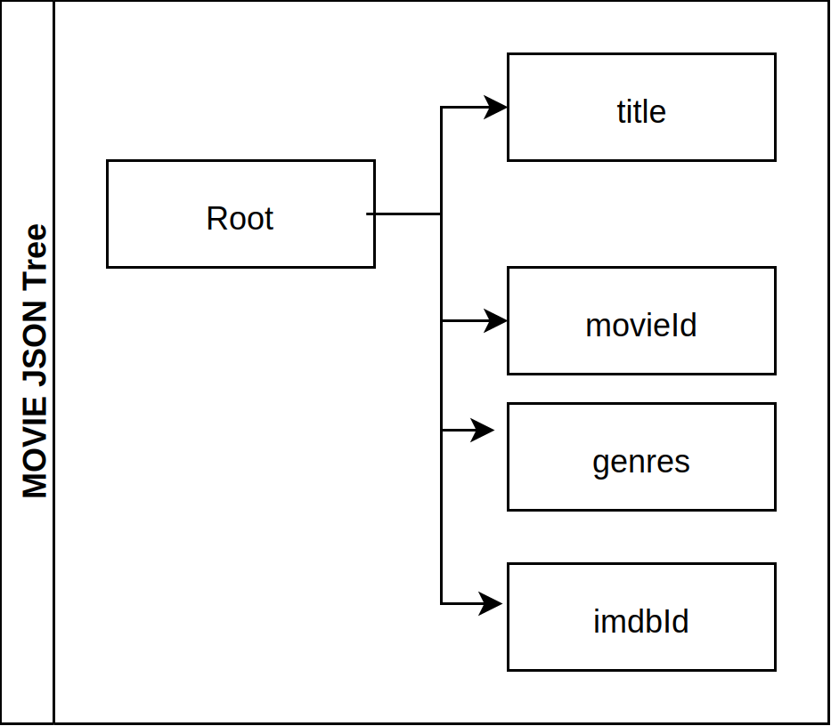

## What is SHACL ?

### Overview

SHACL is a powerful language allowing to define a wide range of constraints on graph data and enforce them. It is for RDF based knowledge graphs what [Json Schema](https://json-schema.org/) is for json data.

Because of the graph nature of the data they apply to, SHACL constraints are relative to graph nodes, their relations and attributes rather than a whole json tree and this is a fundamental difference. A json document has a root element from which the validation process can start while defining the root node for a graph is at best tricky and certainly an ambiguous notion.

In the following 'Movie JSON Tree' representation below, there is a root element ("Root") for all properties within the movie json document and a json schema validation engine will navigate the tree from the root down to some elements.

The graph figure represents the same data within a knowledge graph and there is no default and obvious node to start with as many paths can lead to the movie entity.
For example, all the following three constraints apply to movies even though the paths to get to the movie vary.

* movie entities are of type Movie (value of the property @type)
* the subject of the property imdbId should be of type Movie
* the subject of the property genres should be of type Movie


movie_json_tree           |  movie_graph
:-------------------------:|:-------------------------:
!  |  


So it is important for any validation specification to enable the definition of one or many starting points and one or many paths to follow to navigate down to the data elements to check.
In json the start point is the root of the json document and the data is navigated as a tree and there is no user control on that process.
SHACL on the other hand allows to specify where to start in a graph and from there which paths to follow.

In Blue Brain Nexus, validation using SHACL involves two types of resources:

* A schema: defining in a set of shapes the constraints the data should conform to. A schema can define one or more shapes.
* The data to be validated against the shapes of a schema.

### SHACL Validation Flow


Here is an example of a simple SHACL schema.

```json
{
  "context":"https://bluebrain.github.io/nexus/contexts/shacl-20170720.json",
  "@id":"schemaId_uri",
  "@type" : "nxv:Schema",
  "shapes": [
    {
        "@id":"MovieShape", "targetClass" : ":Movie",
        "property":[
              {"path":"movieId", "datatype":"xsd:string"},
              {"path":"title",   "datatype":"xsd:string"},
              {"path":"genres",  "datatype":"xsd:string"}
        ]
    }
  ],
}
```


Given a shape and a data as inputs, a SHACL processor starts by [selecting what part of the data to focus on]() and then [validate]() whether that part conforms to the shape graph or not.

#### Data selection

A shape can [specify]() the nodes it will validate within a data graph by using one or many [target declarations]().
A shape can target:

* [a specific node]()
* [nodes of a given type]()
* [nodes that are subject of a given property]()
* [nodes that are object of a given property]()

#### Data validation

When focused nodes to validate against a shape are identified then the validation can occurs.
A SHACL processor will check if a node conform to the constraints defined in a shape that selects it.
A validation report is produced at the end.

Shwo example.


The following shape assesses that, to be valid, each movie data **must satisfy** the following constraints:

*  it **must have exactly one** title which must be of type string
*  it **has zero, one or more** genre. If it has a genre associated then the value must be of type string
*  it **has at most one (zero or one)** release date

```json
{
  "context":"http://example.org/shaclcontext",
  "@id" : "ex:PersonShape",
  "targetClass" : "schema:Person",
  "property":[
      {"path":"schema:name",      "datatype":"xsd:string", "maxCount":1, "minCount":1},
      {"path":"schema:jobTitle",  "datatype":"xsd:string"},
      {"path":"schema:birthDate", "datatype":"xsd:date",   "maxCount":1}
  ]
}
```
The term **shape** will be used from now on to refer to the W3C SHACL shapes.

## Schema vs Shape

The [W3C SHACL recommendation]() only defines SHACL shapes as well as ways to [logically related]() them using boolean operators ([AND](), [OR](), [NOT](), [XONE]()).
But shapes are almost never developed alone in production settings. It is useful to be able to:

* [reuse]() an already defined shape for modularity purpose: an [import mechanism]() telling a SHACL validator where to lookup and fetch an already existing shape is needed. This is equivalent to the notion of **class import** in programming language like JAVA.
* group and identify a collection of shapes in order to [document]() and manage them (by mean of CRUD operations: Create, Read, Update, Deprecate/DELETE).
This can be seen as an (not perfect) equivalent of the notion of package in programming languages like JAVA.


In Neuroshapes a **schema** is an object of type nxv:Schema and enables the above capabilities by using the following json syntax:

```json
{
  "context":"http://example.org/shaclcontext",
  "@id" : "ex:SchemaID",
  "@type":"nxv:Schema",
  "imports":"ex:AnImportedShape",
  "shapes" : [
      {"@id" : "ex:AShape",      "@type":"sh:Shape"},
      {"@id" : "ex:AnOtherShape","@type":"sh:Shape"}
  ]
}
```

The table below details main schema property. The complete list of mandatory and recommended schema properties can be found [here]().

key | Description | URI
-------------- | -------------- | --------------
@id | The identifier of the schema | 
@type | The type of the schema. By default it is nxv:Schema|http://www.w3.org/1999/02/22-rdf-syntax-ns#Type
imports | The resources (schema, ontologies,...) to import and to bring in the scope of the current schema | http://www.w3.org/2002/07/owl#imports
shapes | The collection of SHACL shapes defined within the current schema. | http://www.w3.org/2000/01/rdf-schema#isDefinedBy


To illustrate the usage of schemas, let add an affiliation information in the professor instance above.
The professor Jane Doe is affiliated to EPFL which is an organization (identified by [grid.5333.6](http://www.grid.ac/institutes/grid.5333.6) in the [Global Research Identifier Database - GRID](http://www.grid.ac/institutes/grid.5333.6)).

```json
{
  "@context": "http://schema.org/",
  "@type": "schema:Person",
  "@id":"https://orcid.org/0000-0002-3843-3472",
  "name": "Jane Doe",
  "jobTitle": "Professor",
  "birthDate": "1984-06-01",
  "affiliation": {
    "@id":"http://www.grid.ac/institutes/grid.5333.6",
    "@type":"schema:Organization",
    "name":"EPFL"
  }
}
```

The affiliation must **satisfy** the following constraints:

* it **must be of type schema:Organization** (not a Person nor a Process)
* it **must have exactly one** human readable name


The following json payload defines a ex:PersonShape (lines 6 to 13) and a ex:OrganizationShape (lines 14 to 17) in a ex:PersonSchema and adds the constraints about affiliation in line 12:

* to enforce schema:Organization as affiliation's type using the property **class**: the value of class must be either a [URI]() or a [CURIE]().
* to enforce the ex:OrganizationShape through the **node** property: every value of a person's affiliation must conform to the ex:OrganizationShape
which enforces a name property. 


```json
{
  "context":"http://example.org/shaclcontext",
  "@id" : "ex:PersonSchema",
  "@type":"nxv:Schema",
  "shapes" : [{
    "@id" : "ex:PersonShape",
    "targetClass" : "schema:Person",
    "property":[
      {"path":"schema:name",       "datatype":"xsd:string", "maxCount":1, "minCount":1},
      {"path":"schema:jobTitle",   "datatype":"xsd:string"},
      {"path":"schema:birthDate",  "datatype":"xsd:date",   "maxCount":1},
      {"path":"schema:affiliation","class":"schema:Organization","node":"ex:OrganizationShape"}
    ]},{
    "@id" : "ex:OrganizationShape",
    "property":[
      {"path":"schema:name","datatype":"xsd:string","maxCount":1, "minCount":1}
    ]}
  ]
}
```

It is possible to organize the ex:PersonShape and the ex:OrganizationShape differently by defining the 
latter in a different shape and import it within the ex:PersonSchema using the **imports** property.

```json
{
  "context":"http://example.org/shaclcontext",
  "@id" : "ex:PersonSchema",
  "@type":"nxv:Schema",
  "imports":"ex:OrganizationShape",
  "shapes" : [{
    "@id" : "ex:PersonShape",
    "targetClass" : "schema:Person",
    "property":[
      {"path":"schema:name",       "datatype":"xsd:string", "maxCount":1, "minCount":1},
      {"path":"schema:jobTitle",   "datatype":"xsd:string"},
      {"path":"schema:birthDate",  "datatype":"xsd:date",   "maxCount":1},
      {"path":"schema:affiliation","class":"schema:Organization","node":"ex:OrganizationShape"}
    ]}
  ]
}
```

Practically speaking a shape is a schema. After all, [schema means shape in greek](https://en.wikipedia.org/wiki/Schema). The difference between the two in Neuroshapes has
more to do about syntax. The schema syntax allows to defines multiple shapes and relies on the the owl:imports mechanism to enable modular development of shapes.
Ontology engineers will recognize that a schema as defined in this document adopts an owl ontology syntax. Indeed the [domain]() of the owl:imports property is of type owl:Ontology.

From this point, a Neuroshapes schema will be indifferently referred to as a **SHACL schema** or just **schema**.


## Shape vs type

